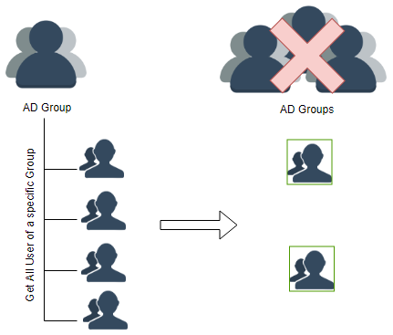

# Create a list of users within a specific group, who are not member of a list of other groups

In this case there was an Active Directory Group which gives every user basic access to AWS Quicksight. Dashboards created in Quicksight are attached to department groups for Quicksight. 

Imagine it like this:

Groups:
- quicksight-access
- finance-quicksight-dashboard-access
- systems-quicksight-dashboard-access
- hr-quicksight-dashboard-access

Every user needs to be in *confluence-access* to gain the basic access rights and to see a dashboard he needs to be in one of the department groups.

## Workflow

To get an overview about all your users and who can access what, I created this script which will do the following:

1) Queries the "quicksight-access" groups for all its users and stores it in *all_users* with their displayname, username, email and cn
2) Search the Active Directory for every user in *all_users* and gathers the groups the user is in
3) If the user is in quicksight-access but in none of the other group, he will be stored in *user_without_groups*. If he is in one of the defined group, he will be stored in *user_with_groups* additionally with the group he was in.
4) The last step is to create a csv file for both list and upload them in a S3 Bucket, from where Quicksight can read the data and display it on a dashboard.

## Change before use

- Please change the variables like the _Base DN_ to you DN
- I used this as Lambda function and it can't import the LDAP3 Modules. You need upload the module as zip file to lambda, in order to use the script.
